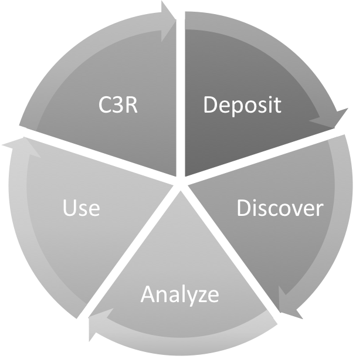

Use Cases
---------

* Key use cases
   * Who - User community/stakeholders involved in each use case
   * What - what the use case is/what happens
* What is out of scope (e.g., workflow interop)

The team identified 13 use cases; we looked at the high level actions and found that they fell into five broad categories, which are represented in the graphic below. NOTE: disregard the arrows in the diagram. We have applied each use case to the stakeholders for those uses.

Action    | Utility Infrastructure | Indexers | Developer | Repository Mgr. | Researcher | Funder | Publisher | Citation Mgr | Library/Curator
--------- | ---------------------- | -------- | --------- | --------------- | ---------- | ------ |  --------- | ------------ | ---------------
Deposit   |                        |          |           |                 |            |        |  |         |              |
Discover  |                        |          |           |                 |            |        |  |         |              |
Analyze   |                        |          |           |                 |            |        |  |         |              |
Use       |                        |          |           |                 |            |        |  |         |              |
C3R3      |                        |          |           |                 |            |        |  |         |              |

Table 1: Use cases and stakeholders. "C3R3" stands for Credit, Comply, Count; Roles, Respect, Reputation.

Next steps:

 1. Align use case numbers with each high-level action
 2. Look at use cases in original proposal to see if they are incorporated into use cases developed at workshops
 3. Add sub-actions to each high-level action
 4. Analyze concepts and alignment with grid
 5. Add dots to grid that illustrate use by each stakeholder
